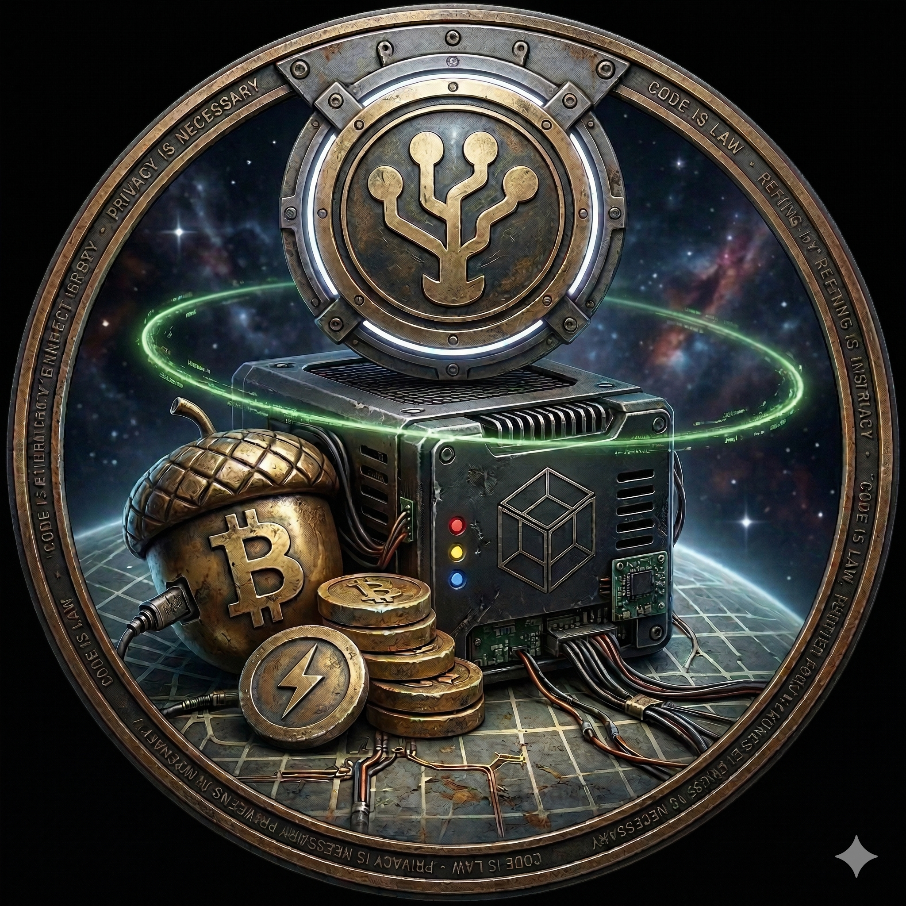

<p align="center">
  
</p>

# Nutshell on StartOS

> Everything not listed in this document should behave the same as upstream
> Nutshell. If a feature, setting, or behavior is not mentioned here, the
> upstream documentation is accurate and fully applicable — see the
> Documentation section of `instructions.md` for links.

[Nutshell](https://github.com/cashubtc/nutshell) is a Cashu mint: a server that issues and redeems Chaumian ecash backed by Bitcoin, settling in and out over Lightning. This package runs the mint half against either Core Lightning over CLNRest or LND over REST on the same StartOS system. A fresh mint chooses one backend once; the wrapper validates and locks that choice without asking the operator to copy credentials between services.

- **Upstream repo:** <https://github.com/cashubtc/nutshell>
- **Wrapper repo:** <https://github.com/Start9-Community/nutshell-startos>

---

## Table of Contents

- [Image and Container Runtime](#image-and-container-runtime)
- [Volume and Data Layout](#volume-and-data-layout)
- [File Models](#file-models)
- [Dependencies](#dependencies)
- [Network Access and Interfaces](#network-access-and-interfaces)
- [Installation and First-Run Flow](#installation-and-first-run-flow)
- [Actions](#actions)
- [Tasks](#tasks)
- [Health Checks](#health-checks)
- [Backups and Restore](#backups-and-restore)
- [Limitations and Differences](#limitations-and-differences)
- [Quick Reference for AI Consumers](#quick-reference-for-ai-consumers)

---

## Image and Container Runtime

The official upstream image, unmodified, in one subcontainer.

| Property     | Value                              |
| ------------ | ---------------------------------- |
| Image        | `cashubtc/nutshell`, digest-pinned |
| Architecture | x86_64, aarch64                    |
| Command      | `poetry run mint`                  |

| Subcontainer   | Purpose                                       |
| -------------- | --------------------------------------------- |
| `nutshell-sub` | The `primary` daemon — the one to `attach` to |

The image reference in the manifest carries both a tag and a `@sha256:` digest, so a rebuild resolves to the image that was actually tested rather than to whatever the tag points at later. Nothing in the image is patched; every setting this package controls is passed as environment on each start.

## Volume and Data Layout

The mint data and wrapper selection state are kept separately so old one-volume
backups remain restorable.

| Volume    | Mount Point | Purpose                                                    |
| --------- | ----------- | ---------------------------------------------------------- |
| `main`    | `/data`     | Mint database, mint seed, and operator settings            |
| `startos` | Not mounted | Wrapper-owned, backed-up Lightning backend selection state |

| Path                  | Volume    | Written by           | Holds                                       |
| --------------------- | --------- | -------------------- | ------------------------------------------- |
| `mint/mint.sqlite3`   | `main`    | Nutshell             | Keysets, proofs, quotes — the mint's ledger |
| `mint_private_key`    | `main`    | Init                 | The seed every issued proof derives from    |
| `startos/config.yaml` | `main`    | Init and the actions | Operator settings                           |
| `store.json`          | `startos` | Migration or setup   | Locked `clnrest` or `lndrest` selection     |

**The seed and the database are one unit.** The seed alone cannot tell you what has been issued, and the database alone cannot be spent against — a restore that pairs one with the other's counterpart makes outstanding ecash unredeemable. They live on the same volume and are backed up together for exactly that reason.

`MINT_DATABASE` points at the `mint/` **directory**; Nutshell chooses the filename inside it.

## File Models

Two models hold the operator settings and the locked backend selection.

| File                  | Volume    | Format | Modelled          | Written by                     |
| --------------------- | --------- | ------ | ----------------- | ------------------------------ |
| `startos/config.yaml` | `main`    | YAML   | `FileHelper.yaml` | Init and configuration actions |
| `store.json`          | `startos` | JSON   | `FileHelper.json` | Migration or one-time setup    |

It is seeded on every init kind by an empty `merge`, which fills in each field's default without disturbing a value already set. Its three groups — `mint_info`, `fees`, `advanced` — map one-to-one onto the three configuration actions, and the mapping into Nutshell's environment happens on every start in `startos/mintEnvironment.ts`.

A hand edit to `config.yaml` survives until an action rewrites the same group, but it will not reach the running mint until the service restarts, because the environment is built at start. Keys the wrapper does not model are preserved in the file and ignored. Do not hand-edit `store.json`: changing Lightning wallets underneath an established mint can break its accounting and strand users' ecash.

Nutshell itself reads no configuration file here — everything reaches it as environment. That has a consequence worth knowing: a setting is consumed at launch, so nothing takes effect until the daemon restarts, and there is no in-container config to inspect for drift. The environment the mint was started with is what `mintEnvironment.ts` produced from this file.

## Dependencies

The manifest declares both Lightning packages optional because a mint uses
exactly one. After setup, `setupDependencies` makes only the locked backend a
running dependency.

| Dependency                     | Selected when | Health check | Why                                                         |
| ------------------------------ | ------------- | ------------ | ----------------------------------------------------------- |
| Core Lightning (`c-lightning`) | `clnrest`     | `lightningd` | Creates and settles the Lightning invoices backing the mint |
| LND (`lnd`)                    | `lndrest`     | `lnd`        | Creates and settles the Lightning invoices backing the mint |

Neither Lightning dependency's volume is mounted.

For Core Lightning, the mint uses the plaintext internal service bridge and
authenticates with the highly privileged rune published in the CLNRest
interface's `?rune=` suffix. **CLNRest is enabled by default in the supported
Core Lightning package; ensure it remains enabled.** Without it, the address
and rune do not resolve and Nutshell fails closed. During a rune rotation, the
runtime keeps the last rune through a temporary missing suffix; a missing
address or a changed malformed suffix still fails closed.

For LND, the mint uses the proxy-terminated HTTPS bridge and verifies the
presented certificate with the StartOS root CA. The masked `lnd-connect-rest`
interface supplies the base64url-encoded raw admin macaroon. The credential
transits the masked interface and wrapper memory, then the wrapper writes it
with mode `0600` only inside the temporary or runtime Nutshell subcontainer.
No dependency volume is mounted, and the operator does not copy a macaroon or
certificate. Both the CLN rune and LND admin macaroon are highly privileged.
The LND credential is not persisted in wrapper state or intentionally placed
in command arguments, environment values, action output, or logs.

Both the Lightning node and Nutshell must be on the same StartOS system. Remote
or LAN Lightning endpoints are not configurable.

## Network Access and Interfaces

One interface, serving the Cashu API that wallets talk to.

| Interface      | Id    | Type | Port | Description                      |
| -------------- | ----- | ---- | ---- | -------------------------------- |
| Cashu Mint API | `api` | api  | 3338 | The Cashu API wallets connect to |

The mint speaks plain HTTP inside its container; StartOS terminates TLS and owns every external address. The interface is typed `api` rather than `ui` because it serves no browser UI — a wallet is the client. The listener is fixed and deliberately not configurable. This public interface is independent from the internal Lightning dependency: operators can publish the mint over LAN, Tor, a domain, or Start Tunnel without changing how Nutshell reaches the selected node.

## Installation and First-Run Flow

There are no credentials to copy by hand. Before installing Nutshell, install
and start the Lightning node this mint will use on the same StartOS system:

- for Core Lightning, ensure its default-enabled CLNRest interface remains
  enabled and restart Core Lightning after any related configuration change; or
- for LND, initialize and unlock its wallet so the masked REST interface is
  available.

At install, the package generates a 256-bit mint seed, seeds `config.yaml` with
defaults, and raises a critical **Select Lightning Backend** task. The hidden
action behind that task authenticates to the exact selected node before writing
`clnrest` or `lndrest` to `store.json`. Nutshell cannot start until validation
succeeds.

The selection is permanent because changing Lightning wallets underneath an
established ecash mint can break its accounting and strand outstanding tokens.
There is no switch or reset action and no fallback to the other node. Existing
installations upgraded from the released `0.20.3:1` package or an earlier
version are automatically locked to CLN, which preserves the backend on which
those mints were created.

On every subsequent start, the wrapper reactively resolves only the selected
backend's address and credentials, builds its environment, and launches the
mint. Operator configuration actions make the mint yours; they do not alter the
locked Lightning choice.

## Actions

Four ordinary actions remain available after setup. The hidden backend selector
is exposed only through the critical first-run task and cannot be repeated after
the choice is stored. Configuration changes take effect on the next restart,
because Nutshell reads its settings from the environment at launch.

### Mint Info

**When to run it:** before publishing the mint's address to anyone. **What it changes:** the `mint_info` group in `config.yaml`, which becomes the NUT-06 metadata wallets display — name, descriptions, message of the day, and the operator contact and policy links. **Cost:** a restart. **Repeat safety:** idempotent; the submitted form is the whole group.

### Lightning Fees

**When to run it:** if outgoing payments are failing for want of routing budget, or if the reserve is costing more than it should. **What it changes:** the percentage and the minimum satoshi reserve held back on each outgoing Lightning payment. **Cost:** a restart. **Repeat safety:** idempotent.

Both are reserves, not charges — unused reserve is not spent. Setting them too low makes melts fail to route; too high makes redemption look expensive to the user.

### Advanced Settings

**When to run it:** to cap exposure, to charge an input fee, or to turn up logging while diagnosing something. **What it changes:** log level, the NUT-02 input fee, per-operation mint and melt ceilings, a total balance ceiling, a redemptions-only switch, and API rate limiting. **Cost:** a restart. **Repeat safety:** idempotent.

Two of these deserve care. A limit of **0 means unlimited**, not "nothing" — the wrapper omits the variable entirely rather than sending a zero Nutshell would read as a hard cap. And **Redemptions Only** stops the mint issuing new ecash while leaving existing ecash redeemable, which is how an operator winds a mint down without stranding anyone.

### Mint Status

**When to run it:** first, on any report that the mint is misbehaving. **What it returns:** whether the seed exists on the volume (never its value), the Lightning backend, the internal listener, the database path, and the current log level. **What it changes:** nothing. **Cost:** none — it reads the volume and the config file, not the container, so it answers while the service is stopped, which is when "is my seed still there?" is the question being asked.

A **Missing** seed on an install that has been running is the one result that is an emergency: without it no outstanding proof can be validated.

## Tasks

Fresh installations raise one critical **Select Lightning Backend** task. It
holds the service until the selected node passes an authenticated probe and the
choice is stored. The task is absent after selection and is not raised for
existing installations migrated to locked CLN.

After selection, StartOS dependency handling and startup resolution enforce the
locked node. An unavailable node or invalid credential stops Nutshell; it does
not prompt for or inspect the other backend.

## Health Checks

One check, on the only daemon.

| Check     | Displayed    | Method                 |
| --------- | ------------ | ---------------------- |
| `primary` | "Cashu Mint" | Port 3338 is listening |

A failure in the first seconds of a start is the mint opening its database; a failure that persists means it exited. Check the selected Lightning dependency first: Core Lightning must be reachable with CLNRest enabled, while LND must be reachable with an initialized and unlocked wallet and a valid masked REST interface. Address, credential, certificate-root, or ephemeral-file failures stop startup before the daemon is created. An upstream database migration that did not complete is the other likely cause and is reported by the service log.

Note the check's limit: a listening port proves the mint is serving, not that it can settle a payment. Only a real mint or melt proves the Lightning path.

## Backups and Restore

The whole `main` volume is copied wholesale. Nothing is excluded and nothing is dumped-and-replayed, which for a mint is the only safe strategy: the database and the seed have to be captured as one consistent pair. A compatibility hook also copies `startos/store.json` when present, preserving the locked backend while allowing older one-volume backups with no wrapper state to restore.

A restored instance needs no Lightning credential re-entered. The seed is on the volume, so init's existence check sees it and does **not** generate a new one — that check is the whole reason a restore is survivable. The stored backend remains authoritative, while its StartOS bridge address and exported credential are resolved fresh on every start. The same backend must be installed and ready on the restored StartOS system; Nutshell will not substitute the other node. A legacy CLN installation or backup with no wrapper state is migrated to locked CLN.

What a restore cannot fix is a stale backup. Ecash issued after the backup exists in wallets but not in the restored ledger, and the mint will refuse those proofs. Back up after any period of real activity, not on a schedule chosen for a stateless service.

Test restores only on an isolated system. Never expose or run the original mint
and a restored copy simultaneously: two live copies can diverge while claiming
the same mint identity.

## Limitations and Differences

1. **The exposed Lightning backends are CLNRest and LND REST.** Upstream's FakeWallet, LNbits, Spark, and other Lightning backends are not available.
2. **The backend cannot be switched after validation.** Create a genuinely fresh mint to use another Lightning wallet.
3. **Lightning nodes must be on the same StartOS system.** Remote and LAN Lightning endpoints are not configurable; this does not restrict public mint exposure.
4. **SQLite only.** Upstream's PostgreSQL option is not exposed.
5. **The internal listener is fixed.** External addressing and TLS belong to StartOS; there are no bind-address or TLS settings.
6. **Upstream management RPC, OIDC authentication, and the Redis cache are not exposed.**
7. **Upstream database migrations run when the mint starts**, which can make a downgrade unsafe. Take a fresh backup before an upstream version bump.
8. **No wallet.** Upstream ships a Cashu wallet alongside the mint; this package runs the mint only.
9. **x86_64 and aarch64 only.** The upstream image publishes no riscv64.

---

## Quick Reference for AI Consumers

```yaml
package_id: nutshell
image: cashubtc/nutshell # digest-pinned in the manifest
architectures:
  - x86_64
  - aarch64
subcontainers:
  - nutshell-sub # the only container
volumes:
  main: /data
  startos: not-mounted # wrapper store.json; copied by backup compatibility hook
file_models:
  - startos/config.yaml # mint_info, fees, advanced
  - store.json # locked lightningBackend: clnrest or lndrest
startos_managed_env_vars:
  - MINT_DATABASE
  - MINT_LISTEN_HOST
  - MINT_LISTEN_PORT
  - MINT_PRIVATE_KEY
  - MINT_BACKEND_BOLT11_SAT
  - MINT_CLNREST_URL
  - MINT_CLNREST_RUNE
  - MINT_LND_REST_ENDPOINT
  - MINT_LND_REST_CERT
  - MINT_LND_REST_MACAROON
  - MINT_LND_REST_CERT_VERIFY
  - MINT_INFO_NAME
  - MINT_INFO_DESCRIPTION
  - MINT_INFO_DESCRIPTION_LONG
  - MINT_INFO_MOTD
  - MINT_INFO_CONTACT
  - MINT_INFO_ICON_URL
  - MINT_INFO_TOS_URL
  - LIGHTNING_FEE_PERCENT
  - LIGHTNING_RESERVE_FEE_MIN
  - LOG_LEVEL
  - MINT_INPUT_FEE_PPK
  - MINT_MAX_MINT_BOLT11_SAT # omitted when unlimited
  - MINT_MAX_MELT_BOLT11_SAT # omitted when unlimited
  - MINT_MAX_BALANCE # omitted when unlimited
  - MINT_BOLT11_DISABLE_MINT
  - MINT_RATE_LIMIT
  - MINT_GLOBAL_RATE_LIMIT_PER_MINUTE
dependencies:
  - c-lightning # optional in manifest; selected CLN mint requires lightningd
  - lnd # optional in manifest; selected LND mint requires lnd
interfaces:
  api: { type: api, port: 3338 }
actions:
  - select-lightning-backend # hidden; only through first-run critical task
  - configure-mint-info
  - configure-fees
  - configure-advanced
  - show-mint-info
tasks:
  - select-lightning-backend # fresh install only; disappears after lock
health_checks:
  - primary # displayed "Cashu Mint"
```
